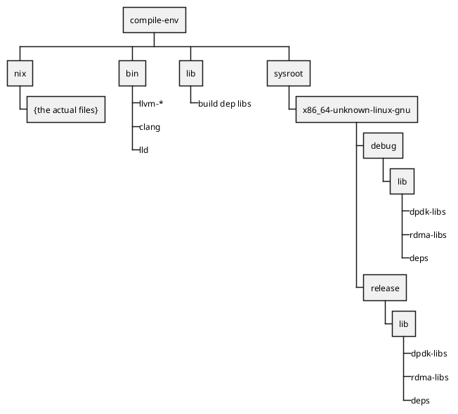

# `compile-env`

Now that we have the [prerequisites](./prerequisites.md) installed, we need to set up our sysroots and build tools.

## The "what"

This should be the easy part:

```bash
just refresh-compile-env
```

This command will use docker to pull the sysroots and compile tools which match the version of `dataplane` you are going to build.

> [!NOTE]
> 
> Q: Why use docker here?  What's wrong with a tar.zst?
> 
> A: Because of layers!
> The compile env is fairly large (~6GB) and the layers allow for incremental updates.  
> If you end up downloading multiple compile-env versions, they will likely share many of the same layers and only require a (comparatively) small amount of additional disk space.


## The "why"

When you ran `just refresh-compile-env` then you `docker pull` the `compile-env` container image.
The script then turns the `compile-env` image into a directory in the source root of the `dataplane` project called `compile-env`.

The `compile-env` directory basically looks like this:

<figure title="compile-env">


> High-level anatomy of the `compile-env`.
</figure>

With that we have distributed (to the developer) all the necessary libraries to link against as well as the exact verison of llvm/clang used to link them.

Unfortunately, for reasons well outside of scope here, the files in `compile-env` are broken symlinks at this point.

We need to fix that (see [fake-nix](./fake-nix.md)).
