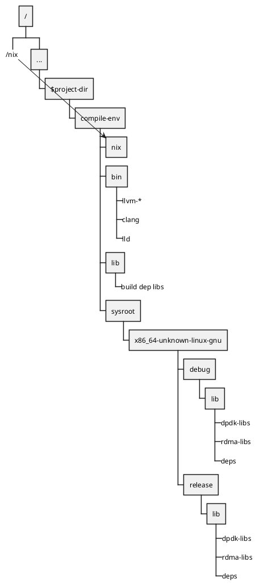

# Fake nix

Take a look at the `/nix` directory under `compile-env` and you will find the actual libraries and files used for this project.
The other directories under `compile-env` pretty much just have symlinks which are _supposed_ to point to `/nix/$whatever`.

The `just fake-nix` recipe hacks around this by making `./compile-env/nix` the target of symlink from `/nix`.

> [!WARNING]
> This is a hack!
> It works fine but the plan won't work if you already have /nix.
> If you already have /nix talk to me, and we will make it work.
> It should be pretty easy (we will just need to export some stuff
> from `dpdk-sys`).
> 
> Yeah, I would love to have a better method of dealing with that
> in the future.

After running `just fake-nix` you get this type of effect.

<figure title="fake-nix">

> High-level anatomy of the `compile-env`.
</figure>

After this point, we make `cargo` use the compile environment via the settings in `.cargo/config.toml`.
