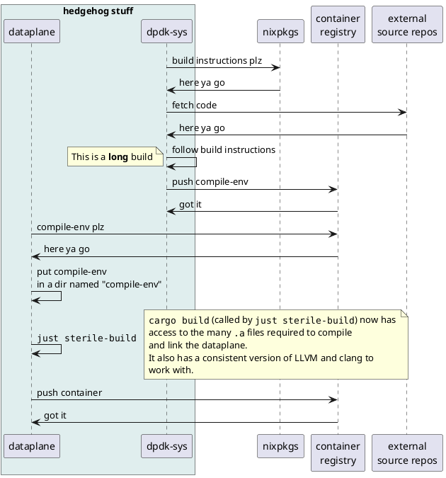

# The build system

If you consider the whole process, the `dataplane` (by necessity) has a fairly complex build.
As a result, much effort has gone into creating a simple development experience.

### Goals:

1. The developer should never need to install DPDK or any of its dependencies manually.
   This requirement stems from the desire to avoid "works on my machine" type behavior.
2. The build should not be hostile to standard developer tooling (e.g. IDE integration or debuggers).
   Wrapping up cargo in a complex build system would do exactly that.
3. The build should be reproducible (when built in a sterile environment) so that the same source code will always produce the same binary.
   This is important for debugging and testing purposes.

### Non goals:

1. Easy development environment on non-Linux systems.  Sorry.  DPDK doesn't really like Windows or Mac.
2. Easy development environment on non x86_64 systems.  We may change in the future to support ARM.

## How it works

The build is split into two main parts.

1. [`dpdk-sys`]
    
   The job of `dpdk-sys` is to compile a [sysroot](https://www.baeldung.com/linux/sysroot) which `dataplane` can consume.[^um-actually]

2. [`dataplane`]

   The job of `dataplane` is to consume the sysroots and other build tools provided by `dpdk-sys` to actually compile and build the `dataplane` binary we will ship.

<figure title="Build-system data-flow">

> Sequence diagram for dpdk-sys / dataplane interaction.
</figure>

## Notes on code repositories architecture

These are notes on the different code repositories used for the control plane
and dataplane for the Gateway, valid as of January 2025.

### Dataplane repository

#### Repository

<https://github.com/githedgehog/dataplane>

#### Role

Main repository for dataplane/gateway

#### Notes

- Public repository
- Set up with dependencies etc. and CI for working on the dataplane

#### CI

Main workflows:

- bump.yml: Update dpdk-sys dependency (compile-env)
- dev.yml, sterile.yml: Tests for PRs
- docs.yml: Generate design docs from dataplane repo (GitHub pages)

### dpdk-sys: Toolchain for dataplane

#### Repository

<https://github.com/githedgehog/dpdk-sys>

#### Role

Contains the build framework, description files, dependency list, and workflow
description for building the compilation environment for the dataplane. The
resulting compile-env image is pulled from the dataplane repository.

#### Notes

- Public repository
- Motivation: These are all linked to the dataplane repository and,
  technically, could be in the same repository. However, rebuilding the
  compilation environment is seldom necessary, and takes time, so it is more
  efficient to have it as a separate repository. See also the previous section
  of this page.

#### CI

- build.yml:
    1. Generate matrix from builds.yml (updated with bump.sh)
    2. `just [...] push`
        1. Builds sysroot
        2. Builds frr, compile-env, doc-env containers
        3. pushes:
            - dpdk-sys/compile-env  -> compilation environment for dataplane
            - dpdk-sys/doc-env      -> docs generation
            - dpdk-sys/frr          -> (unused at the moment)
        4. Generate SBOM
    3. (For PRs: print summary of outdated/vulnerable packages)

- bump.yml: Update external dependencies

### tmp-nat: NAT experiments

#### Repository

<https://github.com/githedgehog/tmp-nat>

#### Role

Experimental repository for working on NAT, on the structure of the related
objects, and on the related lookups

#### Notes

- Currently a private repository, but there's no reason to keep it private and
  it will be published soon
- Meant to be a temporary repository; should be merged into dataplane soon
- Motivation: Developer couldn't build code from dataplane repository on macOS,
  so created a separate repository in the meantime for experimenting and
  iterating fast
- No CI to date

### Control plane

#### Repositories

One parent repository calls the other three as Git submodules:

- <https://github.com/githedgehog/gw-controlplane>
    - <https://github.com/githedgehog/dplane-rpc>
    - <https://github.com/githedgehog/dplane-plugin>
    - <https://github.com/githedgehog/frr>

#### Role

Control plane components

#### Notes

- FRR: Clone from upstream, will likely host some of our own commits
- Currently private repositories (except for the FRR fork), but not particular
  reason for that, should be published soon
- gw-controlplane pulls the three others as Git submodules
- No CI to date

[`dpdk-sys`]: <https://github.com/githedgehog/dpdk-sys>
[`dataplane`]: <https://github.com/githedgehog/dataplane>
[^um-actually]: In fact, `dpdk-sys` produces two sysroots.  One for debug and one for release builds.

