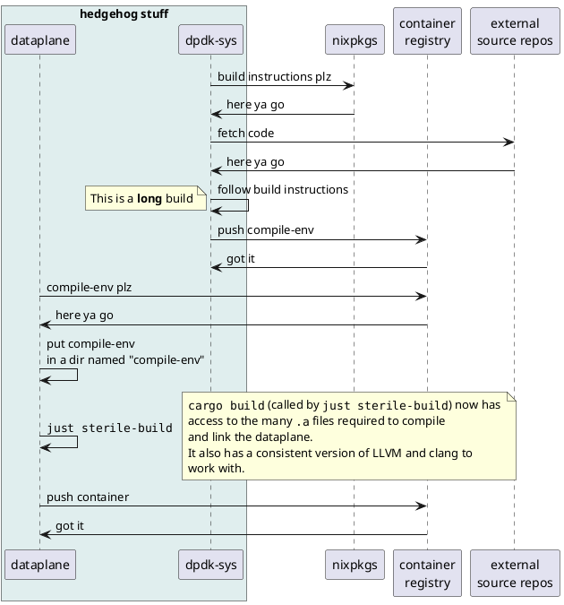

# The build system

If you consider the whole process, the `dataplane` (by necessity) has a fairly complex build.
As a result, much effort has gone into creating a simple development experience.

### Goals:

1. The developer should never need to install DPDK or any of its dependencies manually.
   This requirement stems from the desire to avoid "works on my machine" type behavior.
2. The build should not be hostile to standard developer tooling (e.g. IDE integration or debuggers).
   Wrapping up cargo in a complex build system would do exactly that.
3. The build should be reproducible (when built in a sterile environment) so that the same source code will always produce the same binary.
   This is important for debugging and testing purposes.

### Non goals:

1. Easy development environment on non-Linux systems.  Sorry.  DPDK doesn't really like Windows or Mac.
2. Easy development environment on non x86_64 systems.  We may change in the future to support ARM.

## How it works

The build is split into two main parts.

1. [`dpdk-sys`]
    
   The job of `dpdk-sys` is to compile a [sysroot](https://www.baeldung.com/linux/sysroot) which `dataplane` can consume.[^um-actually]

2. [`dataplane`]

   The job of `dataplane` is to consume the sysroots and other build tools provided by `dpdk-sys` to actually compile and build the `dataplane` binary we will ship.

<figure title="Build-system data-flow">

> Sequence diagram for dpdk-sys / dataplane interaction.
</figure>

[`dpdk-sys`]: https://github.com/githedgehog/dpdk-sys
[`dataplane`]: https://github.com/githedgehog/dataplane
[^um-actually]: In fact, `dpdk-sys` produces four sysroots.  One for each combination of dev/release builds and gnu64 and musl64 builds.
