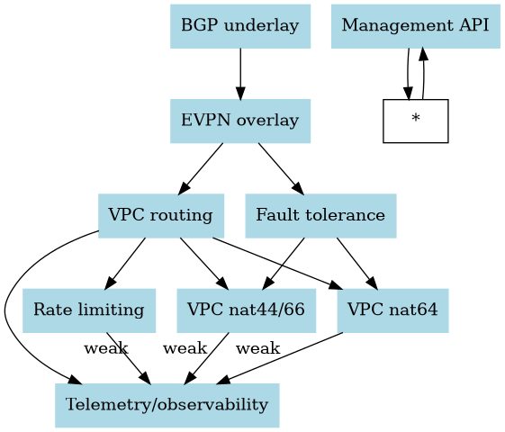
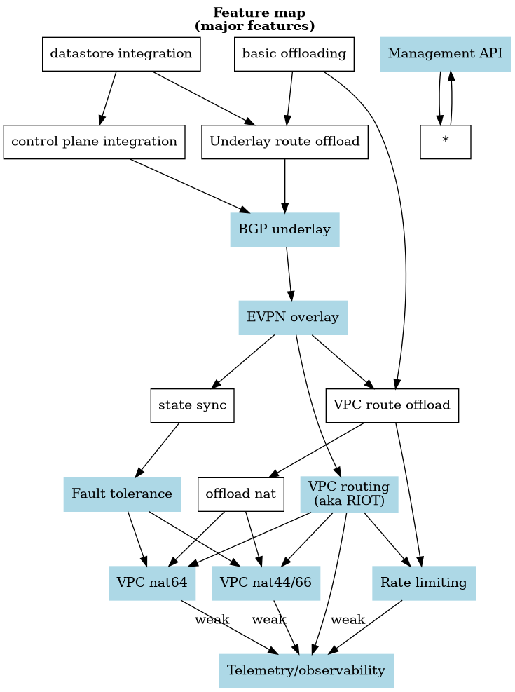
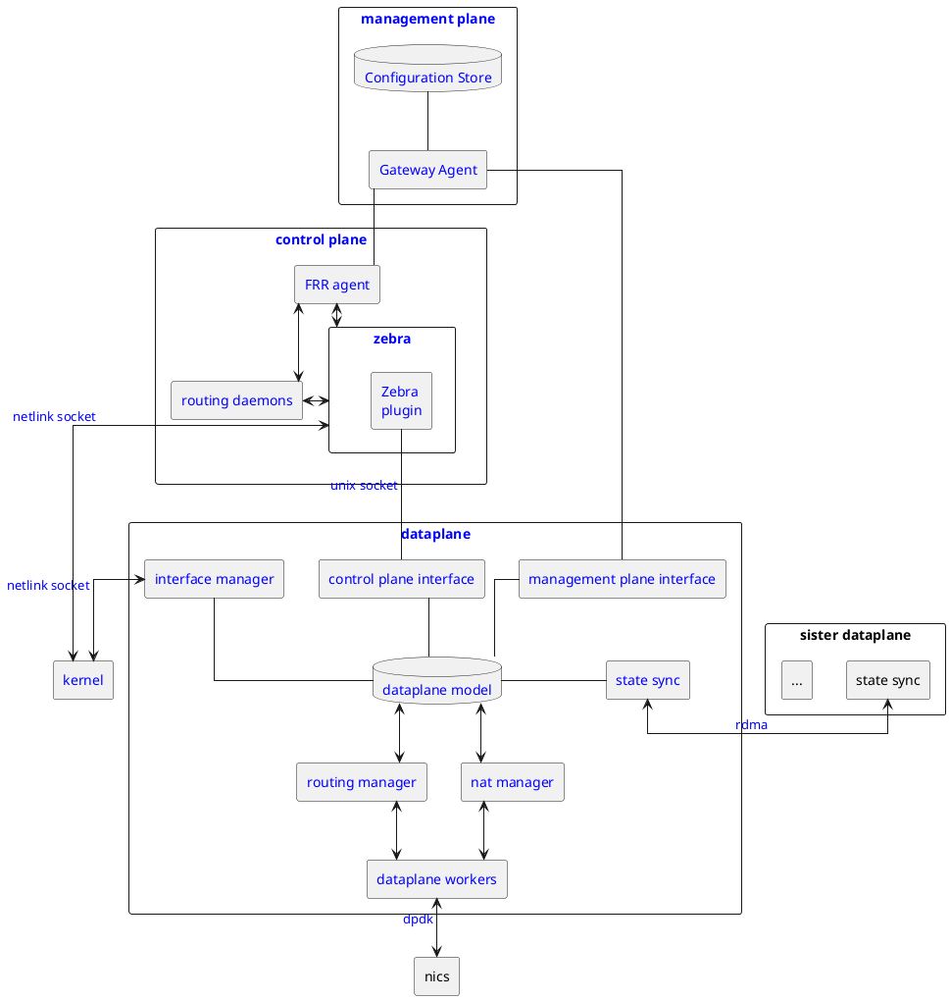

# Required features for MVP

At a very high level, these are the _user facing_ features that we require to reach MVP with the gateway:

1. BGP underlay
2. EVPN overlay
3. VPC routing (aka RIOT)
4. VPC nat 44/66
5. VPC nat 64
6. Telemetry
7. Rate limiting
8. AB fault tolerance
9. Management API

## User-facing features

<figure title="User-facing feature dependencies">

> A graph of the functional dependencies between the required _user facing_ features.
> Each node on the graph represents a feature.
> No feature can be _completed_ without all of the other features which point to it.

</figure>

<figure title="Major feature dependencies (internal)">

> Here is a _very_ high-level graph of the functional dependencies between the required features.
> Each node on the graph represents a feature.
> No feature can be _completed_ without all the other features which point to it.
> Features shown in blue are user facing.
> All other features represent internal implementation concerns.

</figure>

## Component Map

<figure title="Component Map">

> Map of the relationships between planned dataplane components

</figure>

<section>

### Configuration Store

I could (and maybe should) write a book about the design considerations of [Configuration Store].
For the moment I will limit myself to a list of hard and fast requirements:

1. CP in the [CAP theorem](https://en.wikipedia.org/wiki/CAP_theorem) sense.
  - immediate consistency in the sense that

    > Every read receives either the most recent data or an error.

  - partition tolerance

    > The system continues to operate despite an arbitrary number of messages being dropped (or delayed) by the network between nodes.

   The guiding theory is that

  1. It is better to **not** function than to **mal**function.
  2. _**It doesn't matter how quickly you can do the wrong thing**_.

</section>
<section>

### Gateway Agent

This is another subject deserving of a small book.

For now, I will point out some notable design decisions we need to make:

1. Do we expect a subscription model?
2. If not, do we expect the [gateway agent] to explicitly push state to dependent components?

Beyond that, we need to make some high-level design choices:

1. programming language? Likely Go or Rust.
2. REST? GraphQL? I tend to think REST is more appropriate at this time.

</section>
<section>

### FRR agent

Be afraid. Make Fredi fill in this section. But also be afraid.

</section>
<section>

### Zebra Plugin

This is a planned [zebra] plugin in the same spirit as [`fpm`](https://docs.frrouting.org/projects/dev-guide/en/latest/fpm.html#id1) or [`dataplane_fpm_nl`](https://docs.frrouting.org/projects/dev-guide/en/latest/fpm.html#dplane-fpm-nl).

The core idea is to have a plugin that can be dynamically loaded into [zebra] and will listen to the [zebra event stream](https://github.com/FRRouting/frr/blob/ee5a3456d34a756c70ad8856ab7be7bed75ee31c/zebra/zebra_dplane.h#L114-L217) for updates.
The plugin will then take those updates and push them into the dataplane agent, allowing the dataplane to react to route updates.

</section>
<section>

### Routing daemons

For the moment these are [`bgpd`](https://docs.frrouting.org/en/latest/bgp.html) and [`bfdd`](https://docs.frrouting.org/en/latest/bfd.html).

</section>
<section>

### Interface Manager

This is a component that exchanges [netlink] messages with the [kernel] in response to changes in the [dataplane model].
Its responsibilities include

1. construction of virtual network interfaces needed by [zebra]
2. translation of ephemeral linux kernel parameters into ephemeral [dpdk] parameters (e.g. netlink interface index to dpdk interface id).
3. retrieval of information not available to [zebra]/[frr] such as neighbor tables / [ARP] / [IPv6 ND] resolution or [bridge] fdb.

### Control Plane Interface

This component is responsible for adjudicating communication between the [control plane] and the [dataplane].
This component is expected to:

1. Deserialize [bincode] (or perhaps [bitcode]) messages from the [hedgehog plugin] articulating the control plane's rules for the dataplane.
2. Express error messages back to the [control plane] articulating any error conditions.
   For example, if the [dataplane] is unable to offload a route for whatever reason (e.g. rout type not supported) so that said routes are not advertised by the [control plane].
3. Express the offloading status (including counters) back to the [control plane] (if possible).

### Management plane interface

The [management plane interface] is the interface between the [management plane] and the [dataplane].

1. Receive [bincode] (or perhaps [bitcode]) messages from the [gateway agent] over a [unix domain socket] (or perhaps a TCP socket?), parse them, and then update the [dataplane model] to reflect the desired configuration.

</section>
<section>

### Dataplane model

This is an internal component of the [dataplane] which is responsible for managing the _desired_ state of the dataplane. It is updated by the [management plane interface] and is responsible for expressing the _desired state_ (not the observed state) of the [dataplane] to downstream components such as the [routing manager] or the [nat manager].

</section>
<section>

### State sync

This component is responsible for synchronizing the state of sister dataplanes in the name of fault tolerance.

</section>
<section>

### Routing manager

This component is responsible for managing the routing tables for the dataplane. It is responsible for translating the _desired routing rules_ expressed by the [management plane interface] into a set of rules that can be executed by the [dataplane workers][dataplane worker].

</section>
<section>

### NAT manager

This component is responsible for managing the [network address translation] tables for the dataplane. It is responsible for translating the _desired NAT rules_ expressed by the [management plane interface] into a set of rules that can be executed by the [dataplane workers][dataplane worker].

</section>
<section>

### Dataplane workers

This is a collection of [rte lcores] which are responsible for actually performing the packet processing.
The workers are responsible for performing the following tasks:

- Receive packets from the NIC
- Identify local traffic
- Perform underlay routing
- Perform overlay routing
- Perform [NAT]
- Transmit packets to the NIC

</section>
<section>

### Dataplane

The main packet processing engine.

### Management Plane

The management plane is a high-level abstraction that is responsible for

1. Accepting API calls from the end user.
2. Translating those API calls into dataplane and control plane configuration.
3. Storing that configuration in the [Configuration Store]

</section>
<section>

### Control Plane

The control plane is, for the moment, just [bgpd] and [bfdd].

</section>

{{#include ../links.md}}
