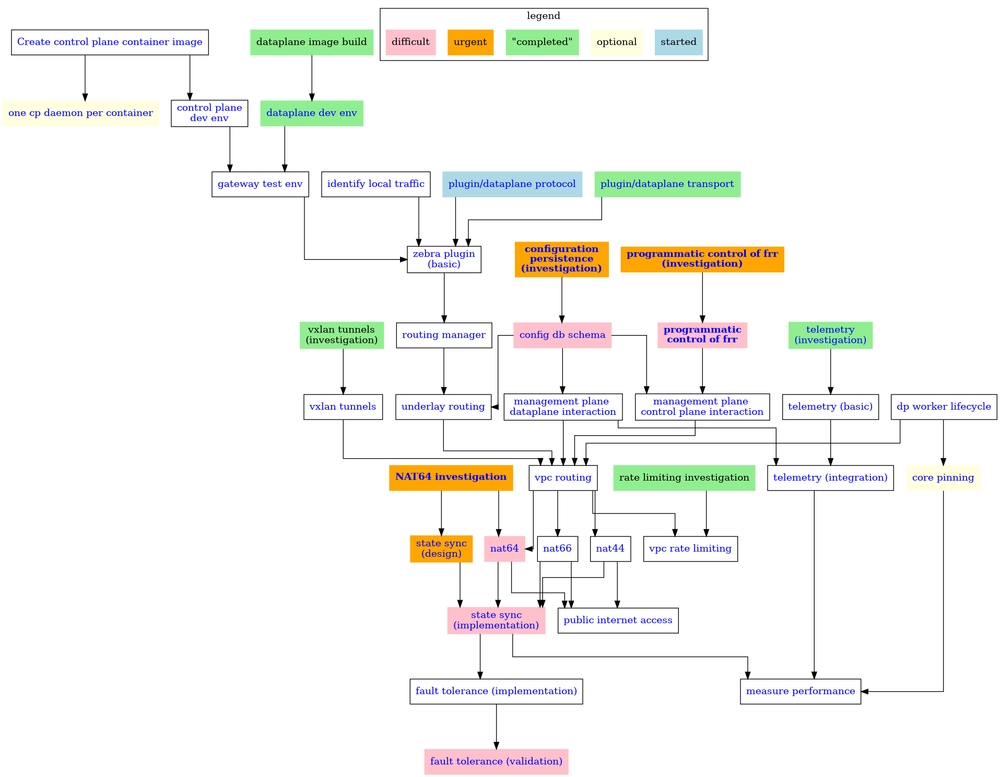

## Development plan

<figure title="Dependency graph (goal oriented)">

<figcaption>

> Graph of the engineering development plan.
> Each node on the graph represents a task or required function.
> No task can be _completed_ without all the other tasks which point to it.
>
> * Tasks shown in orange are points of higher uncertainty and risk.
> * Tasks shown in pink are points of expected higher difficulty.
> * Tasks shown in gray are already completed.
</figcaption>
</figure>

> [!NOTE]
> I am recommending that tasks with higher uncertainty (shown in orange) be addressed with all possible speed.
> Especially if they directly connect to tasks of high expected difficulty.

> [!WARNING]
> Tasks of high expected difficulty are different from tasks which we expect will be very time-consuming.

{{#include ../links.md}}
