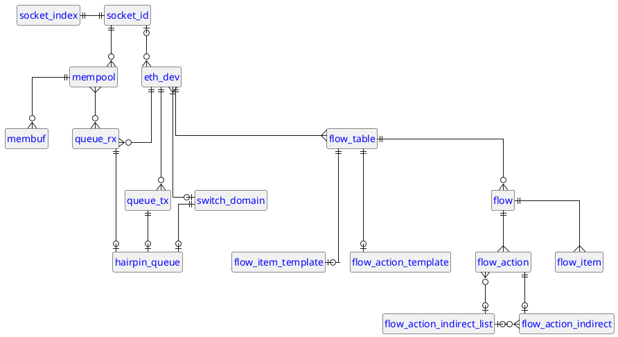

# A map of DPDK abstractions

This document provides a map of the various abstractions in [DPDK], and how they relate to each other.
This is intended to help new developers understand the structure of [DPDK], and how the various components fit together.

<figure title="DPDK entity-relationship diagram">

> The relationships between the various abstractions in DPDK
</figure>

## Glossary

<dl>

* `socket_index`

  A 0-based index into the list of `socket_id`s in the system.

  Keep in mind that DPDK does _not_ always have access to every [NUMA] domain / socket on the system.
  See [warning](#socket_id_is_not_socket_index) for more information.

* `socket_id`

  A unique identifier for a socket.

  A better name for `socket_id` would have been [NUMA] node.  [NUMA] were historically functionally identical to CPU sockets, but in modern (e.g. AMD Genoa) chips that is not true.

  See [warning](#socket_id_is_not_socket_index) and [note](#socket_id_bit_rep) for more information.

</dl>

> [!Warning]
> 
> `socket_id` and `socket_index` are not the same thing.  
> `socket_id` is a unique identifier for a socket, while `socket_index` is an index into the list of sockets ids.
> **The two are related, but different.**  
> See [`rte_socket_id_by_idx`] for more information.

> [!Note]
> 
> `socket_id` is usually represented as a _signed_, 32-bit integer (more exactly, it is a [`c_int`]).
> That said, [DPDK] is often sloppy with signs and bit widths.
> For instance, in the [`rte_lcore_to_socket_id`] function, `socket_id` is represented as an unsigned 32 bit integer.

[DPDK]: https://www.dpdk.org/

[NUMA]: https://en.wikipedia.org/wiki/Non-uniform_memory_access

[`rte_socket_id_by_idx`]: https://doc.dpdk.org/api/rte__lcore_8h.html#a688a671a9fb6c79203de98c684d6e7f2

[`c_int`]: https://doc.rust-lang.org/std/os/raw/type.c_int.html

[`rte_lcore_to_socket_id`]: https://doc.dpdk.org/api/rte__lcore_8h.html#a023b4909f52c3cdf0351d71d2b5032bc
