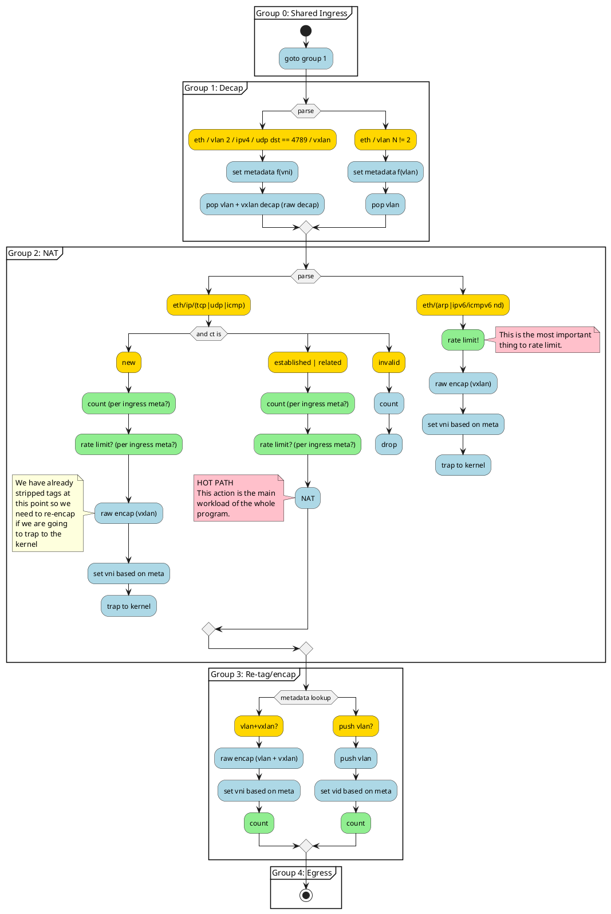
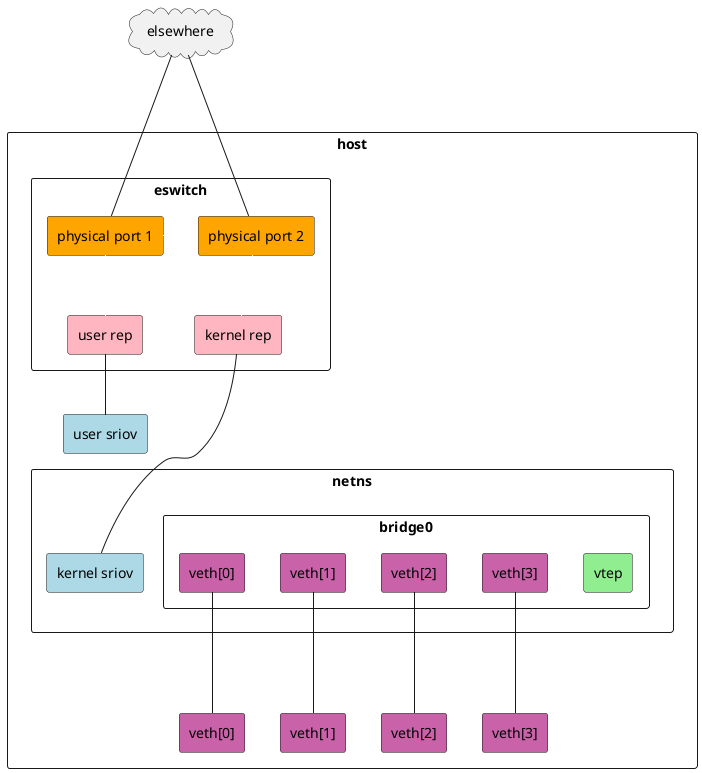
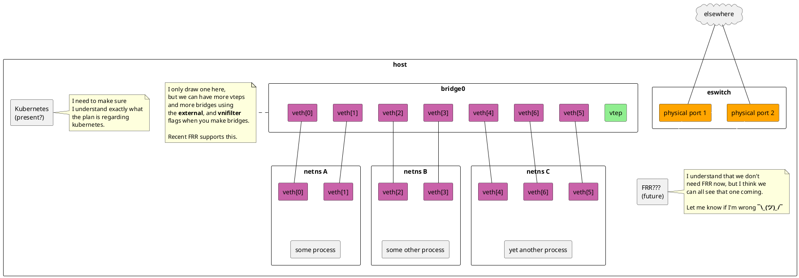
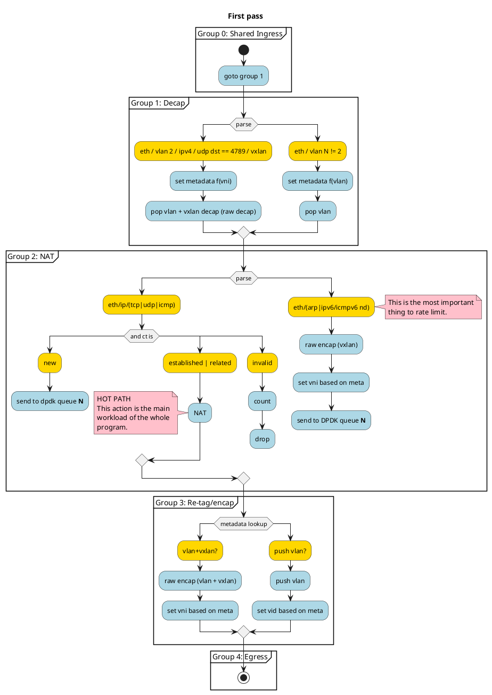
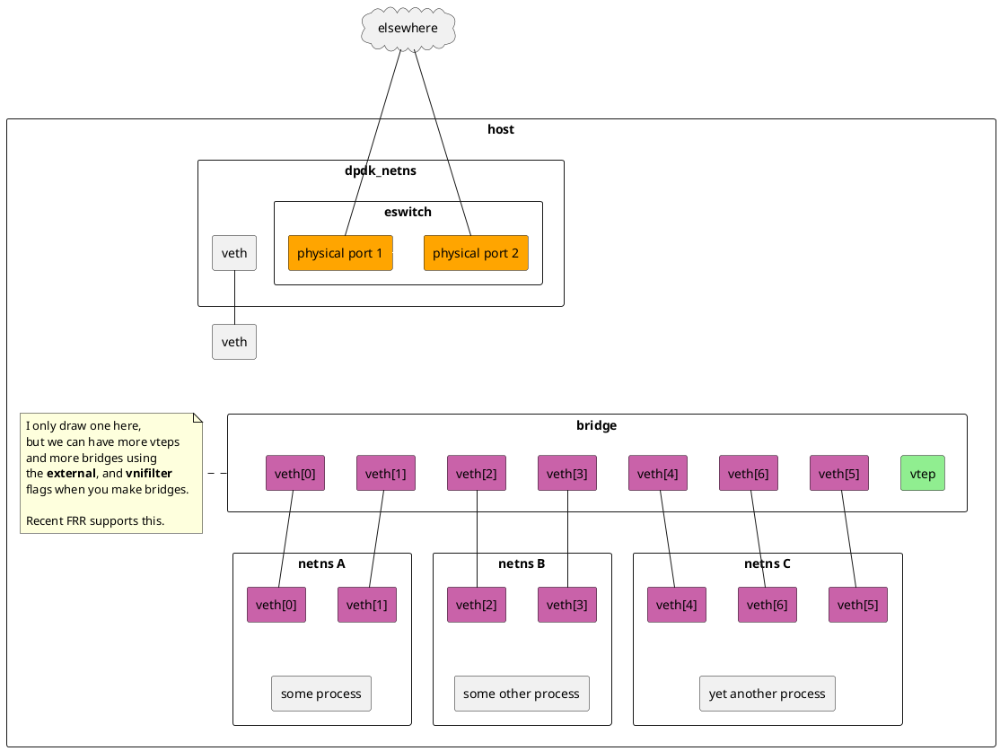

# Offloading the dataplane

These are just unordered design ideas for the moment.

<!-- organize and annotate this -->

<figure>

## Some figure title

```plantuml
@startuml
!pragma teoz true
!$sty = {
	"question": "#gold",
	"action": "#lightblue",
	"future": "#lightgreen",
	"attention": "#pink"
}
!$action = $sty.action
!$question = $sty.question
!$future = $sty.future

group Group 0: Shared Ingress
start
$action:goto group 1;
end group

group Group 1: Decap
switch (parse)
case ()
 $question:eth / vlan 2 / ipv4 / udp dst == 4789 / vxlan;
 $action:set metadata f(vni);
 $action:pop vlan + vxlan decap (raw decap);
case ()
 $question:eth / vlan N != 2;
 $action:set metadata f(vlan);
 $action:pop vlan;
endswitch
end group
group Group 2: NAT
switch (parse)
case ()
$question:eth/ip/(tcp|udp|icmp);
switch (and ct is)
case ()
  $question:new;
  $future:count (per ingress meta?);
  $future:rate limit? (per ingress meta?);
  $action:raw encap (vxlan);
  note left
	We have already
	stripped tags at
	this point so we
	need to re-encap
	if we are going
	to trap to the
	kernel
  end note

  $action:set vni based on meta;
  $action:trap to kernel;
  detach
case ()
  $question:established | related;
  $future:count (per ingress meta?);
  $future:rate limit? (per ingress meta?);
  $action:NAT;
  note left $sty.attention
  HOT PATH
  This action is the main
  workload of the whole
  program.
  end note
case ()
  $question:invalid;
  $action:count;
  $action:drop;
  detach
endswitch
case ()
$question:eth/(arp|ipv6/icmpv6 nd);
$future:rate limit!;
note right $sty.attention
  This is the most important
  thing to rate limit.
end note
$action:raw encap (vxlan);
$action:set vni based on meta;
$action:trap to kernel;
detach
endswitch

end group

group Group 3: Re-tag/encap

switch (metadata lookup)
case ()
  $question:vlan+vxlan?;
  $action:raw encap (vlan + vxlan);
  $action:set vni based on meta;
  $future:count;
case ()
  $question:push vlan?;
  $action:push vlan;
  $action:set vid based on meta;
  $future:count;
endswitch
end group

group Group 4: Egress
stop
end group

@enduml
```

```plantuml
@startuml
!pragma teoz true
!$sty = {
"port": {
"vtep": "#lightgreen",
"rep": "#lightpink",
"sriov": "#lightblue",
"physical": "#orange",
"veth": "#c962a9"
}
}

cloud elsewhere

rectangle host {
rectangle eswitch {
rectangle "physical port 1" as phys_port1 $sty.port.physical
rectangle "physical port 2" as phys_port2 $sty.port.physical
rectangle "user rep" as user_rep $sty.port.rep
rectangle "kernel rep" as kernel_rep $sty.port.rep
}
rectangle "user sriov" as user_sriov $sty.port.sriov

rectangle netns {
rectangle "kernel sriov" as kernel_sriov $sty.port.sriov
rectangle bridge0 as bridge {
rectangle "vtep" as vtep $sty.port.vtep
rectangle "veth[0]" as veth_0_br $sty.port.veth
rectangle "veth[1]" as veth_1_br $sty.port.veth
rectangle "veth[2]" as veth_2_br $sty.port.veth
rectangle "veth[3]" as veth_3_br $sty.port.veth
}
}

rectangle "veth[0]" as veth_0 $sty.port.veth
rectangle "veth[1]" as veth_1 $sty.port.veth
rectangle "veth[2]" as veth_2 $sty.port.veth
rectangle "veth[3]" as veth_3 $sty.port.veth

}

user_rep -- user_sriov
kernel_rep --- kernel_sriov
phys_port1 -[#hidden] phys_port2
phys_port1 -[#hidden]- user_rep
phys_port2 -[#hidden]- kernel_rep

elsewhere --- phys_port1
elsewhere --- phys_port2

veth_0_br --- veth_0
veth_1_br --- veth_1
veth_2_br --- veth_2
veth_3_br --- veth_3
@enduml
```

</figure>

```plantuml
@startuml
!pragma teoz true
!$sty = {
	"port": {
		"vtep": "#lightgreen",
		"rep": "#lightpink",
		"sriov": "#lightblue",
		"physical": "#orange",
		"veth": "#c962a9"
	}
}

cloud elsewhere

rectangle host {
  rectangle eswitch {
	rectangle "physical port 1" as phys_port1 $sty.port.physical
	rectangle "physical port 2" as phys_port2 $sty.port.physical
  }

  rectangle bridge0 as bridge {
	rectangle "vtep" as vtep $sty.port.vtep
	rectangle "veth[0]" as veth_0_br $sty.port.veth
	rectangle "veth[1]" as veth_1_br $sty.port.veth
	rectangle "veth[2]" as veth_2_br $sty.port.veth
	rectangle "veth[3]" as veth_3_br $sty.port.veth
	rectangle "veth[4]" as veth_4_br $sty.port.veth
	rectangle "veth[5]" as veth_5_br $sty.port.veth
	rectangle "veth[6]" as veth_6_br $sty.port.veth
  }

  note right of bridge
  I only draw one here,
  but we can have more vteps
  and more bridges using
  the **external**, and **vnifilter**
  flags when you make bridges.

  Recent FRR supports this.
  end note


  rectangle "netns A" {
	rectangle "veth[0]" as veth_0 $sty.port.veth
	rectangle "veth[1]" as veth_1 $sty.port.veth
	rectangle "some process" as some_process
  }
  rectangle "netns B" {
	rectangle "veth[2]" as veth_2 $sty.port.veth
	rectangle "veth[3]" as veth_3 $sty.port.veth
	rectangle "some other process" as some_other_process
  }

  rectangle "netns C" {
	rectangle "veth[4]" as veth_4 $sty.port.veth
	rectangle "veth[5]" as veth_5 $sty.port.veth
	rectangle "veth[6]" as veth_6 $sty.port.veth
	rectangle "yet another process" as yet_another_process
  }

  rectangle "Kubernetes\n(present?)" as kubernetes

  note right of kubernetes
  I need to make sure
  I understand exactly what
  the plan is regarding
  kubernetes.
  end note

  rectangle "FRR???\n(future)" as frr
  note right of frr
  I understand that we don't
  need FRR now, but I think we
  can all see that one coming.

  Let me know if I'm wrong **¯\_(ツ)_/¯**
  end note
}

phys_port1 -[#hidden] phys_port2

elsewhere -- phys_port1
elsewhere --- phys_port2

veth_0_br -- veth_0
veth_1_br -- veth_1
veth_2_br -- veth_2
veth_3_br -- veth_3
veth_4_br -- veth_4
veth_5_br -- veth_5
veth_6_br -- veth_6

phys_port1 -[#hidden]- frr
phys_port2 -[#hidden]- frr

veth_0 -[hidden]- some_process
veth_1 -[hidden]- some_process

veth_2 -[hidden]- some_other_process
veth_3 -[hidden]- some_other_process

veth_4 -[hidden]- yet_another_process
veth_5 -[hidden]- yet_another_process
veth_6 -[hidden]- yet_another_process

@enduml
```

```puml
@startuml
!pragma teoz true

title First pass

!$sty = {
	"question": "#gold",
	"action": "#lightblue",
	"future": "#lightgreen",
	"attention": "#pink"
}
!$action = $sty.action
!$question = $sty.question

group Group 0: Shared Ingress
start
$action:goto group 1;
end group

group Group 1: Decap
switch (parse)
case ()
 $question:eth / vlan 2 / ipv4 / udp dst == 4789 / vxlan;
 $action:set metadata f(vni);
 $action:pop vlan + vxlan decap (raw decap);
case ()
 $question:eth / vlan N != 2;
 $action:set metadata f(vlan);
 $action:pop vlan;
endswitch
end group
group Group 2: NAT
switch (parse)
case ()
$question:eth/ip/(tcp|udp|icmp);
switch (and ct is)
case ()
  $question:new;
  $action:send to dpdk queue **N**;
  detach
case ()
  $question:established | related;
  $action:NAT;
  note left $sty.attention
  HOT PATH
  This action is the main
  workload of the whole
  program.
  end note
case ()
  $question:invalid;
  $action:count;
  $action:drop;
  detach
endswitch
case ()
$question:eth/(arp|ipv6/icmpv6 nd);
note right $sty.attention
  This is the most important
  thing to rate limit.
end note
$action:raw encap (vxlan);
$action:set vni based on meta;
$action:send to DPDK queue **N**;
detach
endswitch

end group

group Group 3: Re-tag/encap

switch (metadata lookup)
case ()
  $question:vlan+vxlan?;
  $action:raw encap (vlan + vxlan);
  $action:set vni based on meta;
case ()
  $question:push vlan?;
  $action:push vlan;
  $action:set vid based on meta;
endswitch
end group

group Group 4: Egress
stop
end group

@enduml
```

```puml
@startuml
!pragma teoz true

title First pass

!$sty = {
"question": "#gold",
"action": "#lightblue",
"future": "#lightgreen",
"attention": "#pink"
}
!$action = $sty.action
!$question = $sty.question

group Group 0: Shared Ingress
start
$action:goto group 1;
end group

group Group 1: Decap
switch (parse)
case ()
$question:eth / vlan 2 / ipv4 / udp dst == 4789 / vxlan;
$action:set metadata f(vni);
$action:pop vlan + vxlan decap (raw decap);
case ()
$question:eth / vlan N != 2;
$action:set metadata f(vlan);
$action:pop vlan;
endswitch
end group
group Group 2: NAT
switch (parse)
case ()
$question:eth/ip/(tcp|udp|icmp);
switch (and ct is)
case ()
$question:new;
$action:send to dpdk queue **N**;
detach
case ()
$question:established | related;
$action:NAT;
note left $sty.attention
HOT PATH
This action is the main
workload of the whole
program.
end note
case ()
$question:invalid;
$action:count;
$action:drop;
detach
endswitch
case ()
$question:eth/(arp|ipv6/icmpv6 nd);
note right $sty.attention
This is the most important
thing to rate limit.
end note
$action:raw encap (vxlan);
$action:set vni based on meta;
$action:send to DPDK queue **N**;
detach
endswitch

end group

group Group 3: Re-tag/encap

switch (metadata lookup)
case ()
$question:vlan+vxlan?;
$action:raw encap (vlan + vxlan);
$action:set vni based on meta;
case ()
$question:push vlan?;
$action:push vlan;
$action:set vid based on meta;
endswitch
end group

group Group 4: Egress
stop
end group

@enduml
```

```puml
@startuml
!pragma teoz true
!$sty = {
	"port": {
		"vtep": "#lightgreen",
		"rep": "#lightpink",
		"sriov": "#lightblue",
		"physical": "#orange",
		"veth": "#c962a9"
	}
}

cloud elsewhere

rectangle host {
  rectangle dpdk_netns {
	rectangle eswitch {
	  rectangle "physical port 1" as phys_port1 $sty.port.physical
	  rectangle "physical port 2" as phys_port2 $sty.port.physical
	}
	rectangle veth as veth.dpdk
  }

  rectangle veth as veth.kernel

  rectangle bridge as bridge {
	rectangle "vtep" as vtep $sty.port.vtep
	rectangle "veth[0]" as veth_0_br $sty.port.veth
	rectangle "veth[1]" as veth_1_br $sty.port.veth
	rectangle "veth[2]" as veth_2_br $sty.port.veth
	rectangle "veth[3]" as veth_3_br $sty.port.veth
	rectangle "veth[4]" as veth_4_br $sty.port.veth
	rectangle "veth[5]" as veth_5_br $sty.port.veth
	rectangle "veth[6]" as veth_6_br $sty.port.veth
  }

  note right of bridge
  I only draw one here,
  but we can have more vteps
  and more bridges using
  the **external**, and **vnifilter**
  flags when you make bridges.

  Recent FRR supports this.
  end note

  rectangle "netns A" {
	rectangle "veth[0]" as veth_0 $sty.port.veth
	rectangle "veth[1]" as veth_1 $sty.port.veth
	rectangle "some process" as some_process
  }
  rectangle "netns B" {
	rectangle "veth[2]" as veth_2 $sty.port.veth
	rectangle "veth[3]" as veth_3 $sty.port.veth
	rectangle "some other process" as some_other_process
  }
  rectangle "netns C" {
	rectangle "veth[4]" as veth_4 $sty.port.veth
	rectangle "veth[5]" as veth_5 $sty.port.veth
	rectangle "veth[6]" as veth_6 $sty.port.veth
	rectangle "yet another process" as yet_another_process
  }

}

phys_port1 -[#hidden] phys_port2

elsewhere -- phys_port1
elsewhere --- phys_port2

veth_0_br -- veth_0
veth_1_br -- veth_1
veth_2_br -- veth_2
veth_3_br -- veth_3
veth_4_br -- veth_4
veth_5_br -- veth_5
veth_6_br -- veth_6

veth_0 -[hidden]- some_process
veth_1 -[hidden]- some_process

veth_2 -[hidden]- some_other_process
veth_3 -[hidden]- some_other_process

veth_4 -[hidden]- yet_another_process
veth_5 -[hidden]- yet_another_process
veth_6 -[hidden]- yet_another_process

veth.dpdk -- veth.kernel
veth.kernel -[hidden]- bridge

@enduml
```

```plantuml
@startuml
!pragma teoz true
!$sty = {
	"question": "#gold",
	"action": "#lightblue",
	"future": "#lightgreen",
	"attention": "#pink"
}
!$action = $sty.action
!$question = $sty.question
!$future = $sty.future

group Group 0: Shared Ingress
start
$action:goto group 1;
end group

group Group 1: Decap
switch (parse)
case ()
 $question:eth / vlan 2 / ipv4 / udp dst == 4789 / vxlan;
 $action:set metadata f(vni);
 $action:pop vlan + vxlan decap (raw decap);
case ()
 $question:eth / vlan N != 2;
 $action:set metadata f(vlan);
 $action:pop vlan;
endswitch
end group
group Group 2: NAT
switch (parse)
case ()
$question:eth/ip/(tcp|udp|icmp);
switch (and ct is)
case ()
  $question:new;
  $future:count (per ingress meta?);
  $future:rate limit? (per ingress meta?);
  $action:raw encap (vxlan);
  note left
	We have already
	stripped tags at
	this point so we
	need to re-encap
	if we are going
	to trap to the
	kernel
  end note

  $action:set vni based on meta;
  $action:trap to kernel;
  detach
case ()
  $question:established | related;
  $future:count (per ingress meta?);
  $future:rate limit? (per ingress meta?);
  $action:NAT;
  note left $sty.attention
  HOT PATH
  This action is the main
  workload of the whole
  program.
  end note
case ()
  $question:invalid;
  $action:count;
  $action:drop;
  detach
endswitch
case ()
$question:eth/(arp|ipv6/icmpv6 nd);
$future:rate limit!;
note right $sty.attention
  This is the most important
  thing to rate limit.
end note
$action:raw encap (vxlan);
$action:set vni based on meta;
$action:trap to kernel;
detach
endswitch

end group

group Group 3: Re-tag/encap

switch (metadata lookup)
case ()
  $question:vlan+vxlan?;
  $action:raw encap (vlan + vxlan);
  $action:set vni based on meta;
  $future:count;
case ()
  $question:push vlan?;
  $action:push vlan;
  $action:set vid based on meta;
  $future:count;
endswitch
end group

group Group 4: Egress
stop
end group

@enduml
```

```plantuml
@startuml
!pragma teoz true
!$sty = {
	"port": {
		"vtep": "#lightgreen",
		"rep": "#lightpink",
		"sriov": "#lightblue",
		"physical": "#orange",
		"veth": "#c962a9"
	}
}

cloud elsewhere

rectangle host {
  rectangle eswitch {
	rectangle "physical port 1" as phys_port1 $sty.port.physical
	rectangle "physical port 2" as phys_port2 $sty.port.physical
	rectangle "user rep" as user_rep $sty.port.rep
	rectangle "kernel rep" as kernel_rep $sty.port.rep
  }
  rectangle "user sriov" as user_sriov $sty.port.sriov

  rectangle netns {
  	rectangle "kernel sriov" as kernel_sriov $sty.port.sriov
	rectangle bridge0 as bridge {
	  rectangle "vtep" as vtep $sty.port.vtep
	  rectangle "veth[0]" as veth_0_br $sty.port.veth
	  rectangle "veth[1]" as veth_1_br $sty.port.veth
	  rectangle "veth[2]" as veth_2_br $sty.port.veth
	  rectangle "veth[3]" as veth_3_br $sty.port.veth
	}
  }

  rectangle "veth[0]" as veth_0 $sty.port.veth
  rectangle "veth[1]" as veth_1 $sty.port.veth
  rectangle "veth[2]" as veth_2 $sty.port.veth
  rectangle "veth[3]" as veth_3 $sty.port.veth

}

user_rep -- user_sriov
kernel_rep --- kernel_sriov
phys_port1 -[#hidden] phys_port2
phys_port1 -[#hidden]- user_rep
phys_port2 -[#hidden]- kernel_rep

elsewhere --- phys_port1
elsewhere --- phys_port2

veth_0_br --- veth_0
veth_1_br --- veth_1
veth_2_br --- veth_2
veth_3_br --- veth_3
@enduml
```

```plantuml
@startuml
!pragma teoz true
!$sty = {
	"port": {
		"vtep": "#lightgreen",
		"rep": "#lightpink",
		"sriov": "#lightblue",
		"physical": "#orange",
		"veth": "#c962a9"
	}
}

cloud elsewhere

rectangle host {
  rectangle eswitch {
	rectangle "physical port 1" as phys_port1 $sty.port.physical
	rectangle "physical port 2" as phys_port2 $sty.port.physical
  }

  rectangle bridge0 as bridge {
	rectangle "vtep" as vtep $sty.port.vtep
	rectangle "veth[0]" as veth_0_br $sty.port.veth
	rectangle "veth[1]" as veth_1_br $sty.port.veth
	rectangle "veth[2]" as veth_2_br $sty.port.veth
	rectangle "veth[3]" as veth_3_br $sty.port.veth
	rectangle "veth[4]" as veth_4_br $sty.port.veth
	rectangle "veth[5]" as veth_5_br $sty.port.veth
	rectangle "veth[6]" as veth_6_br $sty.port.veth
  }

  note right of bridge
  I only draw one here,
  but we can have more vteps
  and more bridges using
  the **external**, and **vnifilter**
  flags when you make bridges.

  Recent FRR supports this.
  end note


  rectangle "netns A" {
	rectangle "veth[0]" as veth_0 $sty.port.veth
	rectangle "veth[1]" as veth_1 $sty.port.veth
	rectangle "some process" as some_process
  }
  rectangle "netns B" {
	rectangle "veth[2]" as veth_2 $sty.port.veth
	rectangle "veth[3]" as veth_3 $sty.port.veth
	rectangle "some other process" as some_other_process
  }

  rectangle "netns C" {
	rectangle "veth[4]" as veth_4 $sty.port.veth
	rectangle "veth[5]" as veth_5 $sty.port.veth
	rectangle "veth[6]" as veth_6 $sty.port.veth
	rectangle "yet another process" as yet_another_process
  }

  rectangle "Kubernetes\n(present?)" as kubernetes

  note right of kubernetes
  I need to make sure
  I understand exactly what
  the plan is regarding
  kubernetes.
  end note

  rectangle "FRR???\n(future)" as frr
  note right of frr
  I understand that we don't
  need FRR now, but I think we
  can all see that one coming.

  Let me know if I'm wrong **¯\_(ツ)_/¯**
  end note
}

phys_port1 -[#hidden] phys_port2

elsewhere -- phys_port1
elsewhere --- phys_port2

veth_0_br -- veth_0
veth_1_br -- veth_1
veth_2_br -- veth_2
veth_3_br -- veth_3
veth_4_br -- veth_4
veth_5_br -- veth_5
veth_6_br -- veth_6

phys_port1 -[#hidden]- frr
phys_port2 -[#hidden]- frr

veth_0 -[hidden]- some_process
veth_1 -[hidden]- some_process

veth_2 -[hidden]- some_other_process
veth_3 -[hidden]- some_other_process

veth_4 -[hidden]- yet_another_process
veth_5 -[hidden]- yet_another_process
veth_6 -[hidden]- yet_another_process

@enduml
```

```plantuml
@startuml
!pragma teoz true

title First pass

!$sty = {
	"question": "#gold",
	"action": "#lightblue",
	"future": "#lightgreen",
	"attention": "#pink"
}
!$action = $sty.action
!$question = $sty.question

group Group 0: Shared Ingress
start
$action:goto group 1;
end group

group Group 1: Decap
switch (parse)
case ()
 $question:eth / vlan 2 / ipv4 / udp dst == 4789 / vxlan;
 $action:set metadata f(vni);
 $action:pop vlan + vxlan decap (raw decap);
case ()
 $question:eth / vlan N != 2;
 $action:set metadata f(vlan);
 $action:pop vlan;
endswitch
end group
group Group 2: NAT
switch (parse)
case ()
$question:eth/ip/(tcp|udp|icmp);
switch (and ct is)
case ()
  $question:new;
  $action:send to dpdk queue **N**;
  detach
case ()
  $question:established | related;
  $action:NAT;
  note left $sty.attention
  HOT PATH
  This action is the main
  workload of the whole
  program.
  end note
case ()
  $question:invalid;
  $action:count;
  $action:drop;
  detach
endswitch
case ()
$question:eth/(arp|ipv6/icmpv6 nd);
note right $sty.attention
  This is the most important
  thing to rate limit.
end note
$action:raw encap (vxlan);
$action:set vni based on meta;
$action:send to DPDK queue **N**;
detach
endswitch

end group

group Group 3: Re-tag/encap

switch (metadata lookup)
case ()
  $question:vlan+vxlan?;
  $action:raw encap (vlan + vxlan);
  $action:set vni based on meta;
case ()
  $question:push vlan?;
  $action:push vlan;
  $action:set vid based on meta;
endswitch
end group

group Group 4: Egress
stop
end group

@enduml
```

```plantuml
@startuml
!pragma teoz true
!$sty = {
	"port": {
		"vtep": "#lightgreen",
		"rep": "#lightpink",
		"sriov": "#lightblue",
		"physical": "#orange",
		"veth": "#c962a9"
	}
}

cloud elsewhere

rectangle host {
  rectangle dpdk_netns {
	rectangle eswitch {
	  rectangle "physical port 1" as phys_port1 $sty.port.physical
	  rectangle "physical port 2" as phys_port2 $sty.port.physical
	}
	rectangle veth as veth.dpdk
  }

  rectangle veth as veth.kernel

  rectangle bridge as bridge {
	rectangle "vtep" as vtep $sty.port.vtep
	rectangle "veth[0]" as veth_0_br $sty.port.veth
	rectangle "veth[1]" as veth_1_br $sty.port.veth
	rectangle "veth[2]" as veth_2_br $sty.port.veth
	rectangle "veth[3]" as veth_3_br $sty.port.veth
	rectangle "veth[4]" as veth_4_br $sty.port.veth
	rectangle "veth[5]" as veth_5_br $sty.port.veth
	rectangle "veth[6]" as veth_6_br $sty.port.veth
  }

  note right of bridge
  I only draw one here,
  but we can have more vteps
  and more bridges using
  the **external**, and **vnifilter**
  flags when you make bridges.

  Recent FRR supports this.
  end note

  rectangle "netns A" {
	rectangle "veth[0]" as veth_0 $sty.port.veth
	rectangle "veth[1]" as veth_1 $sty.port.veth
	rectangle "some process" as some_process
  }
  rectangle "netns B" {
	rectangle "veth[2]" as veth_2 $sty.port.veth
	rectangle "veth[3]" as veth_3 $sty.port.veth
	rectangle "some other process" as some_other_process
  }
  rectangle "netns C" {
	rectangle "veth[4]" as veth_4 $sty.port.veth
	rectangle "veth[5]" as veth_5 $sty.port.veth
	rectangle "veth[6]" as veth_6 $sty.port.veth
	rectangle "yet another process" as yet_another_process
  }

}

phys_port1 -[#hidden] phys_port2

elsewhere -- phys_port1
elsewhere --- phys_port2

veth_0_br -- veth_0
veth_1_br -- veth_1
veth_2_br -- veth_2
veth_3_br -- veth_3
veth_4_br -- veth_4
veth_5_br -- veth_5
veth_6_br -- veth_6

veth_0 -[hidden]- some_process
veth_1 -[hidden]- some_process

veth_2 -[hidden]- some_other_process
veth_3 -[hidden]- some_other_process

veth_4 -[hidden]- yet_another_process
veth_5 -[hidden]- yet_another_process
veth_6 -[hidden]- yet_another_process

veth.dpdk -- veth.kernel
veth.kernel -[hidden]- bridge

@enduml
```
