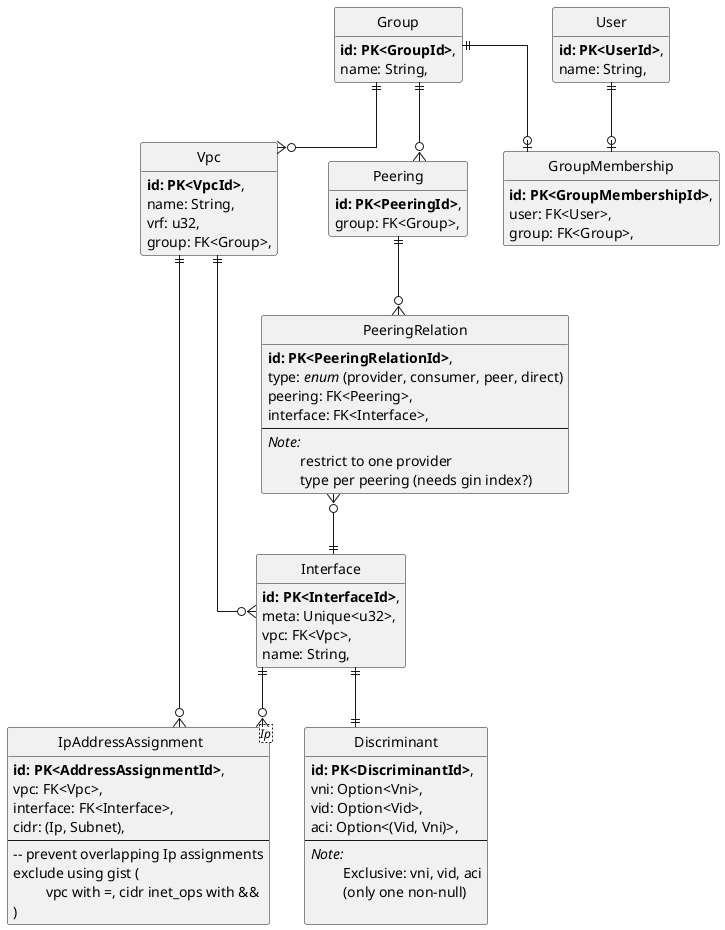

# Configuration database schema

One of our biggest TODO items is to create an ER diagram for our configuration database.

To be clear, I am not asserting that we need to use an RDBMS in practice.
We just need an exacting spec for the relationships between our configuration data.

<figure title="ER Diagram for config db">

> We need to think about access controls and cardinality more.

</figure>
