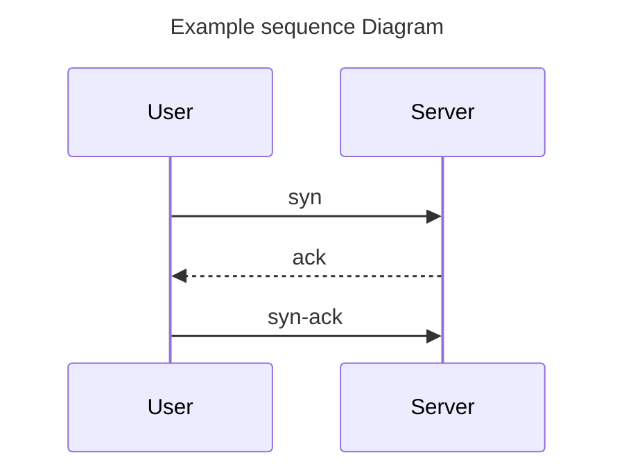
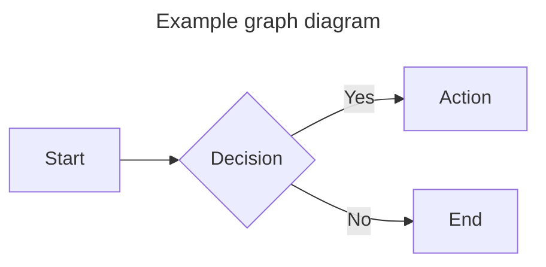
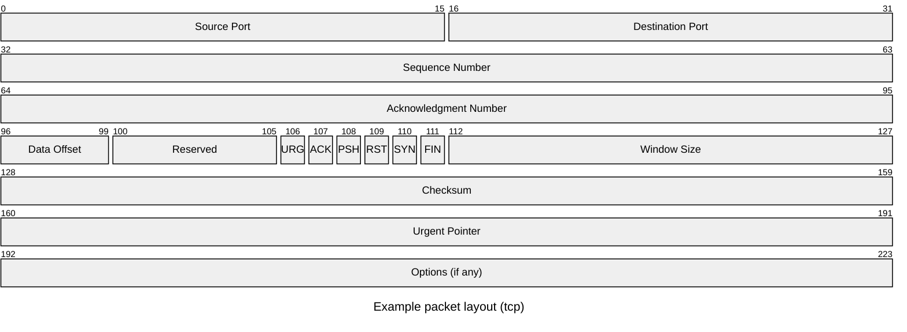

# Diagrams

## Guidelines

- **Use diagrams for complex concepts** - Visualizations can sometimes communicate architectural relationships and data
  flow more effectively than text.
- **Mermaid diagrams** - Embed directly in markdown using code fences with `mermaid` language annotation
  - Our usage of rustdoc supports mermaid diagrams in code fences.
  - Mermaid diagrams are also supported by github.
  - Thus mermaid diagrams may be included in source code or the project's markdown files as needed.

Mermaid diagrams are easier to read and maintain than diagrams stored in binary formats (such as PNG or JPEG) or even
text formats like SVG.
Because mermaid is supported by github and (with our modifications) rustdoc, you may freely use mermaid diagrams in
your code or markdown files where helpful.

## Especially useful diagram types

- **[Sequence diagram]**: useful for describing network interactions and data flow within a program.
- **[Packet diagram]**: useful for describing the structure of network packets.
- **[Flowchart]**: good general purpose diagram for visualizing data flow and control flow.
- **[State diagram]**: useful for describing the states a system may adopt and the legal paths between those states.
- **[Entity-Relationship diagram]**: useful for describing the relationships between entities in a type system,
  especially as it relates to their relative [cardinalities].

## Mermaid Examples

The sequence diagram is commonly useful in describing network interactions.

Graph diagrams are useful for visualizing relationships between entities.

Packet diagrams are useful for visualizing network packet layouts.

## Draw.io Diagrams

Follow these requirements:

- Keep diagrams synchronized with code changes
- Try to identify where code implementation has gone out of sync with diagrams
- Require SVG format for draw.io diagrams for version control compatibility.
- Binary formats such as PNG are not generally acceptable to assets to check into git.
- Require the filename pattern: `*.drawio.svg`
- When reviewing draw.io files, verify they were modified using the draw.io tool (check for proper metadata)
- If practical, prefer mermaid diagrams over draw.io as they are easier to maintain and update.

<!--links-->

[Sequence diagram]: https://mermaid.js.org/syntax/sequenceDiagram.html
[Flowchart]: https://mermaid.js.org/syntax/flowchart.html
[State diagram]: https://mermaid.js.org/syntax/stateDiagram.html
[Packet diagram]: https://mermaid.js.org/syntax/packet.html
[Entity-Relationship diagram]: https://mermaid.js.org/syntax/entityRelationshipDiagram.html
[cardinalities]: https://en.wikipedia.org/wiki/Cardinality
