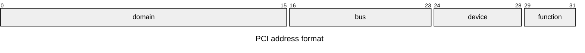

# PCI device enumeration and attributes

This module provides comprehensive support for PCI (Peripheral Component Interconnect)
device representation, including device addressing, attributes, and topology.

## Overview

PCI devices are identified by a hierarchical addressing scheme:

- **Domain**: The PCI domain (segment) number
- **Bus**: The bus number within the domain
- **Device**: The device number on the bus
- **Function**: The function number within the device

Together these form a PCI address like `0000:03:00.0`

