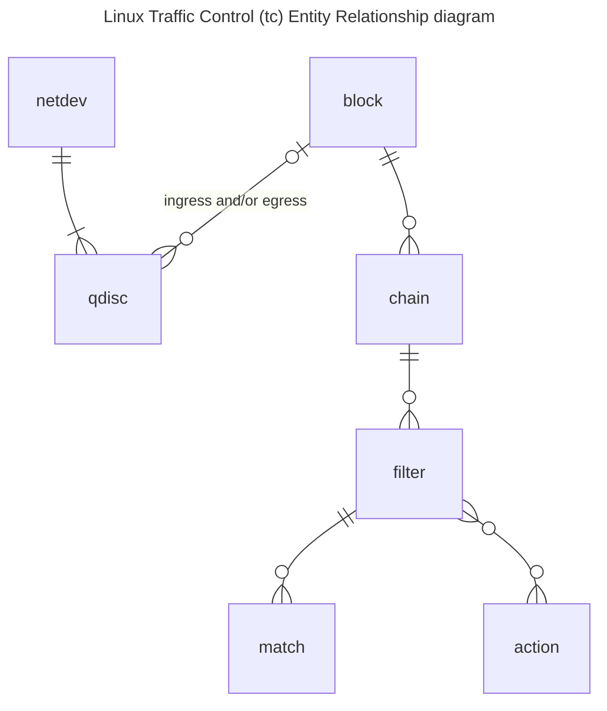

# The linux TC subsystem

TC is the linux traffic control system.
It is a complex beast, but it is also very powerful.
I have tried to provide a high-level overview of the parts of `tc` which we need here.

## What are these things?

### qdisc

**A `qdisc` is short for queuing discipline**.
There are many different algorithms for queueing packets, but the non-trivial case pretty much exclusively focuses on _the order in which packets **egress**_ a network card.

`qdisc` also applies to ingress traffic, but in a much more trivial sense.
You can't really control the order or timing in which packets arrive, so the ingress `qdisc` is mostly just a place to attach [filters], [chains], and (optionally) [block]s.

In general, `qdisc`s are quite complex and powerful, but we only need the "trivial" case (ingress) for our current design.
Our ingress qdisc of choice is called clsact; basically FIFO but with the ability to attach (potentially offloaded) [filter]s rules.

### filter

A filter is basically a tuple of

1. a match criteria; some list of selectors which decide if this filter applies to a given packet.
2. a list of actions; some set of operations to perform if the match criteria apply.
3. a priority; a number to disambiguate which filter applies if multiple filters match.  In linux, tc filters match _lower_ priority first.

Filters exist within a [chain], and chains live on network interfaces or [block]s of network interfaces.

Some examples of filters include matching on ARP, or IPv4 packets with source ip in the range `192.168.5.0/24`.
Match criteria can be combined to form complex filters.
In such cases, a packet must match all listed criteria to trigger the [action]s.

### action

An action is some type of manipulation or event that may occur when a packet matches on a [filter] criteria.

Examples of action include 

* dropping packets, 
* editing source or destination ip addresses, 
* pushing or popping VLAN headers, 
* redirecting the packet to the ingress or egress pipeline of another network device,
* encapsulating the packet in a VXLAN packet,
* or mirroring (copying) the packet to another network device.

Actions are reference counted and **may be attached to more than one filter.**
More specifically, each action has four important variables associated with it

1. The action `kind`.  `kind` is a static string which identifies the family of the action.  Examples include `mirred`, which covers packet redirect and mirroring; `gact`, which includes actions like `drop` or `jump`; and `tunnel_key`, which includes encapsulation and decapsulation actions.  Many other families of actions exist in the linux `tc` subsystem.
2. The action `index`.  `index`, is a unique (_per `kind`_) identifier to track the specific incidence of a given action.  For example, if you might create a `gact` dro action with index 17.  You may then attach that drop command to several different filters by referencing that index on filter creation.  If you recycle an action in this way then all the filters associated with that action will update the hit counters for that action.  Reuse of actions in this way may also save resources in the network card (assuming the matches and action can be offloaded).
3. The action `bindcnt`.  This is the number of active filters which reference this action.
4. The action `refcnt`.  This is the reference count of the action.  This number is either equal to the `bindcnt` or is equal to the `bindcnt` plus one.

If you create an action as part of a filter creation command, then you the `refcnt` and the `bindcnt` numbers will be equal.
If you create an action without attaching it to a filter, you need to set the `refcnt` to one (in which case the `bindcnt` will be zero automatically).

Linux will automatically remove any action if and only if the `bindcnt` _and_ `refcnt` are equal to zero.
"Deleting" an action sets its `refcnt` to its `bindcnt`.
Note that this means you need to both delete an action _and_ detach that action from all active filters before linux will actually remove the action.
This is a good thing!
It prevents you from kicking the legs out from under your own network card by deleting an action (some actions make no sense without their accompanying actions).

### chain

A `chain` is basically a list of filters sorted in descending order of priority.
A network device or [block] may have multiple chains attached to it.
Packets start processing on the device or [block]'s chain 0, and may or may not move to another chain (depending on which actions they encounter).
`jump` and `goto chain` are among the possible [action]s.

### block

A `block` is basically a list of [qdisc]s on different network interfaces.

A [filter] may be attached to either a [qdisc] or a `block` of qdiscs.
This is useful in our case!

Imagine you have 10 network interfaces which are all part of the same underlying physical switch ASIC.
If you configure `tc` [filter]s in the most basic way, you may need to install the same rule to the ASIC 10 times.

This is bad for a few major reasons:

1. It is pointlessly complex.  You would need to keep track of all 10 rules.  You need to create it 10 times, delete it 10 times, update it 10 times, track the counters 10 times, and so on.
2. It is wasteful of resources in the ASIC.  Installing the rule into the hardware once saves TCAM or SRAM in the ASIC (both of which are in limited supply).
3. It is more prone to race conditions.  Updating the rule in one place is usually much easier to sequence when transitioning between rule sets.

[action]: #action
[block]: #block
[filter]: #filter
[qdisc]: #qdisc
